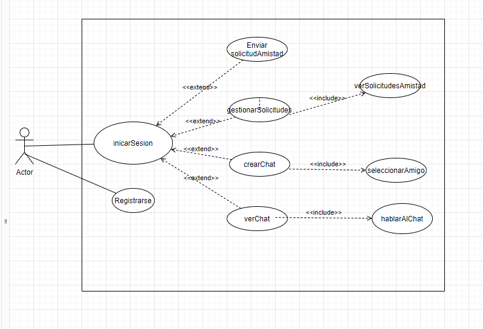
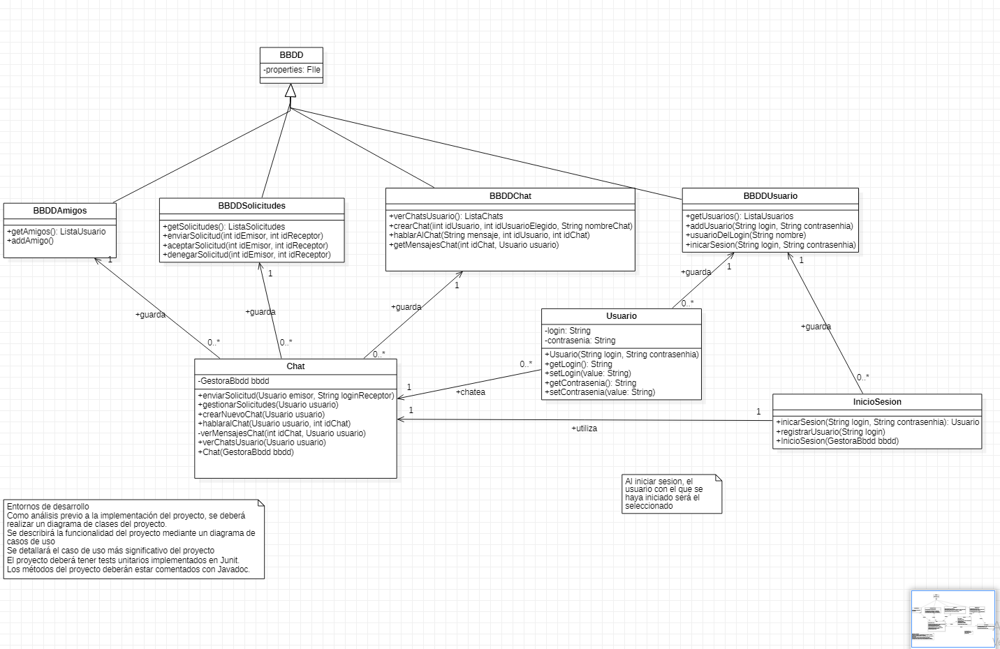

# Whatsapp2 💬

## Descripción

Aplicación de mensajería instantánea desarrollada en Java con interfaz gráfica Swing, inspirada en WhatsApp. Implementa el patrón de arquitectura MVC (Modelo-Vista-Controlador) y utiliza una base de datos SQL para la persistencia de datos.

## ✨ Características

- 🔐 Sistema de autenticación de usuarios (login/registro)
- 💬 Mensajería instantánea entre usuarios
- 👥 Gestión de contactos y solicitudes de amistad
- 💾 Persistencia de datos mediante base de datos SQL
- 🎨 Interfaz gráfica intuitiva con Java Swing
- 📊 Sistema de chats individuales
- ⚡ Arquitectura MVC bien definida

## 🏗️ Arquitectura del Proyecto

El proyecto sigue el patrón **MVC (Modelo-Vista-Controlador)**:

```
Whatsapp2/
├── baseDatos/          # Scripts SQL para la base de datos
│   └── YASTAAAAAAA.sql
├── entorno/            # Diagramas de casos de uso y clases
│   ├── DIAGRAMA_CASOS.png
│   └── DIAGRAMA_CLASES.png
├── src/
│   ├── bbdd/           # Configuración de conexión a BD
│   │   └── PropiedadesConexion
│   ├── controlador/    # Lógica de control de la aplicación
│   │   ├── GestoraBbdd.java
│   │   ├── Main.java
│   │   └── Messenger.java
│   ├── modelo/         # Clases del modelo de datos
│   │   ├── Chat.java
│   │   ├── InicioSesion.java
│   │   ├── Mensaje.java
│   │   ├── Solicitud.java
│   │   └── Usuario.java
│   └── vista/          # Interfaz gráfica
│       └── Menu.java
└── sqljdbc_9.2/        # Driver JDBC para SQL Server
```

## 🛠️ Tecnologías Utilizadas

- **Java SE** - Lenguaje de programación principal
- **Java Swing** - Framework para la interfaz gráfica
- **SQL Server** - Sistema de gestión de base de datos
- **JDBC** - Conector Java para bases de datos SQL
- **IntelliJ IDEA / NetBeans** - IDE de desarrollo

## 📋 Requisitos Previos

- **Java JDK 8** o superior
- **SQL Server** (o compatible)
- **JDBC Driver** para SQL Server (incluido en `sqljdbc_9.2/`)
- IDE Java (IntelliJ IDEA, Eclipse, NetBeans)

## 🚀 Instalación y Configuración

### 1. Clonar el repositorio

```bash
git clone https://github.com/georgesdsk/Whatsapp2.git
cd Whatsapp2
```

### 2. Configurar la Base de Datos

1. Instalar SQL Server o utilizar una instancia existente
2. Ejecutar el script SQL ubicado en `baseDatos/YASTAAAAAAA.sql`

```sql
-- Desde SQL Server Management Studio o tu cliente SQL preferido
source baseDatos/YASTAAAAAAA.sql
```

3. Configurar las credenciales de conexión en `src/bbdd/PropiedadesConexion`:

```properties
url=jdbc:sqlserver://localhost:1433;databaseName=whatsapp2
username=tu_usuario
password=tu_contraseña
```

### 3. Compilar y Ejecutar

**Desde línea de comandos:**

```bash
# Compilar
javac -d bin -cp "sqljdbc_9.2/*" src/**/*.java

# Ejecutar
java -cp "bin:sqljdbc_9.2/*" controlador.Main
```

**Desde un IDE:**

1. Abrir el proyecto en tu IDE favorito
2. Añadir el driver JDBC a las librerías del proyecto (`sqljdbc_9.2/`)
3. Ejecutar la clase `controlador.Main.java`

## 📖 Uso

### Registro de Usuario

1. Al iniciar la aplicación, selecciona "Registrarse"
2. Completa los datos del formulario (nombre, usuario, contraseña)
3. Confirma el registro

### Inicio de Sesión

1. Introduce tu usuario y contraseña
2. Haz clic en "Iniciar Sesión"

### Enviar Mensajes

1. Selecciona un contacto de tu lista
2. Escribe tu mensaje en el campo de texto
3. Presiona "Enviar" o Enter

### Agregar Contactos

1. Ve a la sección de "Añadir contacto"
2. Busca el usuario por nombre
3. Envía una solicitud de amistad
4. Espera a que el usuario acepte la solicitud

## 🗄️ Modelo de Datos

El sistema utiliza las siguientes entidades principales:

- **Usuario**: Información de los usuarios (id, nombre, usuario, contraseña)
- **Chat**: Conversaciones entre usuarios
- **Mensaje**: Contenido de los mensajes (texto, fecha, remitente, destinatario)
- **Solicitud**: Peticiones de amistad pendientes
- **InicioSesion**: Gestión de sesiones activas

## 📊 Diagramas

En la carpeta `entorno/` puedes encontrar:

- **Diagrama de Casos de Uso**: Muestra las funcionalidades disponibles
- **Diagrama de Clases**: Estructura de las clases del sistema

## 🤝 Contribuciones

Las contribuciones son bienvenidas. Si deseas mejorar el proyecto:

1. Haz un fork del repositorio
2. Crea una rama para tu feature (`git checkout -b feature/nueva-funcionalidad`)
3. Commit tus cambios (`git commit -m 'Añadir nueva funcionalidad'`)
4. Push a la rama (`git push origin feature/nueva-funcionalidad`)
5. Abre un Pull Request

## 📝 To-Do / Mejoras Futuras

- [ ] Implementar mensajería en tiempo real con sockets
- [ ] Añadir grupos de chat
- [ ] Soporte para envío de archivos e imágenes
- [ ] Notificaciones push
- [ ] Cifrado end-to-end de mensajes
- [ ] Migrar a base de datos más moderna (PostgreSQL/MySQL)
- [ ] Refactorizar a arquitectura cliente-servidor
- [ ] Interfaz responsive con JavaFX o migración a web
- [ ] 
## 📸 Capturas de Pantalla

### Diagrama de Casos de Uso



El diagrama de casos de uso muestra las interacciones principales:

- **Iniciar Sesión**: El usuario puede autenticarse en el sistema
- **Registrarse**: Nuevos usuarios pueden crear una cuenta
- **Enviar Solicitud de Amistad**: Gestión de solicitudes entre usuarios
- **Gestionar Solicitudes**: Aceptar o rechazar solicitudes pendientes
- **Crear Chat**: Iniciar nuevas conversaciones
- **Ver Chat**: Acceder a conversaciones existentes
- **Hablar al Chat**: Enviar mensajes en tiempo real
- **Seleccionar Amigo**: Elegir contacto para chatear

### Diagrama de Clases



La arquitectura del sistema está compuesta por las siguientes clases principales:

- **Usuario**: Gestiona la información y autenticación de usuarios
- **Chat**: Representa las conversaciones entre usuarios
- **Mensaje**: Almacena el contenido de cada mensaje
- **Solicitud**: Maneja las peticiones de amistad
- **InicioSesion**: Controla las sesiones activas
- **Menu**: Interfaz gráfica principal
- **Messenger**: Lógica de negocio de mensajería
- **GestoraBbdd**: Capa de acceso a datos

## 🎯 Casos de Uso Detallados

### 1. Registro de Usuario

**Actor**: Usuario nuevo

**Precondiciones**: La aplicación está iniciada

**Flujo Principal**:
1. El usuario selecciona "Registrarse"
2. El sistema muestra el formulario de registro
3. El usuario introduce: nombre, usuario, contraseña
4. El sistema valida los datos
5. El sistema crea la cuenta en la base de datos
6. El sistema confirma el registro exitoso

**Postcondiciones**: El usuario queda registrado y puede iniciar sesión

### 2. Envío de Mensaje

**Actor**: Usuario autenticado

**Precondiciones**: 
- El usuario ha iniciado sesión
- Tiene al menos un contacto agregado

**Flujo Principal**:
1. El usuario selecciona un contacto de la lista
2. El sistema muestra el chat correspondiente
3. El usuario escribe un mensaje
4. El usuario presiona "Enviar"
5. El sistema almacena el mensaje en la BD
6. El sistema muestra el mensaje en el chat

**Postcondiciones**: El mensaje queda registrado y visible

### 3. Gestión de Solicitudes de Amistad

**Actor**: Usuario autenticado

**Precondiciones**: El usuario ha recibido solicitudes

**Flujo Principal**:
1. El usuario accede a "Solicitudes pendientes"
2. El sistema muestra la lista de solicitudes
3. El usuario selecciona una solicitud
4. El usuario elige "Aceptar" o "Rechazar"
5. El sistema actualiza el estado en la BD
6. Si acepta: se añade a la lista de contactos

**Postcondiciones**: La solicitud queda procesada

## 🗃️ Estructura de la Base de Datos

### Tabla: usuarios
```sql
CREATE TABLE usuarios (
    id_usuario INT PRIMARY KEY AUTO_INCREMENT,
    nombre VARCHAR(100) NOT NULL,
    usuario VARCHAR(50) UNIQUE NOT NULL,
    contraseña VARCHAR(255) NOT NULL,
    fecha_registro DATETIME DEFAULT CURRENT_TIMESTAMP
);
```

### Tabla: chats
```sql
CREATE TABLE chats (
    id_chat INT PRIMARY KEY AUTO_INCREMENT,
    id_usuario1 INT NOT NULL,
    id_usuario2 INT NOT NULL,
    fecha_creacion DATETIME DEFAULT CURRENT_TIMESTAMP,
    FOREIGN KEY (id_usuario1) REFERENCES usuarios(id_usuario),
    FOREIGN KEY (id_usuario2) REFERENCES usuarios(id_usuario)
);
```

### Tabla: mensajes
```sql
CREATE TABLE mensajes (
    id_mensaje INT PRIMARY KEY AUTO_INCREMENT,
    id_chat INT NOT NULL,
    id_remitente INT NOT NULL,
    contenido TEXT NOT NULL,
    fecha_envio DATETIME DEFAULT CURRENT_TIMESTAMP,
    leido BOOLEAN DEFAULT FALSE,
    FOREIGN KEY (id_chat) REFERENCES chats(id_chat),
    FOREIGN KEY (id_remitente) REFERENCES usuarios(id_usuario)
);
```

### Tabla: solicitudes
```sql
CREATE TABLE solicitudes (
    id_solicitud INT PRIMARY KEY AUTO_INCREMENT,
    id_remitente INT NOT NULL,
    id_destinatario INT NOT NULL,
    estado ENUM('pendiente', 'aceptada', 'rechazada') DEFAULT 'pendiente',
    fecha_solicitud DATETIME DEFAULT CURRENT_TIMESTAMP,
    FOREIGN KEY (id_remitente) REFERENCES usuarios(id_usuario),
    FOREIGN KEY (id_destinatario) REFERENCES usuarios(id_usuario)
);
```

## 🔧 Configuración Avanzada

### Configuración de la Base de Datos

Edita el archivo `src/bbdd/PropiedadesConexion` con tus credenciales:

```properties
# Configuración de conexión SQL Server
driver=com.microsoft.sqlserver.jdbc.SQLServerDriver
url=jdbc:sqlserver://localhost:1433;databaseName=whatsapp2;encrypt=false
username=tu_usuario
password=tu_contraseña

# Pool de conexiones (opcional)
pool.size=10
pool.timeout=30000
```

### Variables de Entorno

Para mayor seguridad, usa variables de entorno:

```bash
export DB_HOST=localhost
export DB_PORT=1433
export DB_NAME=whatsapp2
export DB_USER=tu_usuario
export DB_PASSWORD=tu_contraseña
```

### Compilación con Maven (Futuro)

Para migrar a Maven, crea un `pom.xml`:

```xml
<project>
    <modelVersion>4.0.0</modelVersion>
    <groupId>com.georgesdsk</groupId>
    <artifactId>whatsapp2</artifactId>
    <version>1.0.0</version>
    
    <dependencies>
        <dependency>
            <groupId>com.microsoft.sqlserver</groupId>
            <artifactId>mssql-jdbc</artifactId>
            <version>9.2.0.jre8</version>
        </dependency>
    </dependencies>
</project>
```

## 🐛 Solución de Problemas Comunes

### Error de Conexión a la Base de Datos

**Problema**: `SQLException: Cannot connect to database`

**Solución**:
1. Verifica que SQL Server esté ejecutándose
2. Comprueba las credenciales en `PropiedadesConexion`
3. Asegúrate de que el puerto 1433 esté abierto
4. Verifica que el driver JDBC esté en el classpath

```bash
# Verificar servicio SQL Server (Windows)
net start MSSQLSERVER

# Verificar servicio SQL Server (Linux)
sudo systemctl status mssql-server
```

### Interfaz Gráfica No Responde

**Problema**: La ventana se congela al realizar acciones

**Solución**: Las operaciones de BD deben ejecutarse en hilos separados

```java
SwingUtilities.invokeLater(() -> {
    // Operaciones de UI aquí
});
```

### Error al Enviar Mensajes

**Problema**: Los mensajes no se guardan correctamente

**Solución**:
1. Verifica que exista un chat entre los usuarios
2. Comprueba que el usuario esté autenticado
3. Revisa los logs de errores de la BD

## 🧪 Testing

### Tests Unitarios (Futuro)

```java
@Test
public void testRegistroUsuario() {
    Usuario usuario = new Usuario("Test", "testuser", "password123");
    boolean registrado = gestoraBbdd.registrarUsuario(usuario);
    assertTrue(registrado);
}

@Test
public void testEnvioMensaje() {
    Mensaje mensaje = new Mensaje(1, 1, 2, "Hola!");
    boolean enviado = messenger.enviarMensaje(mensaje);
    assertTrue(enviado);
}
```

### Tests de Integración

```java
@Test
public void testFlujoCompleto() {
    // 1. Registrar usuario
    // 2. Iniciar sesión
    // 3. Enviar solicitud
    // 4. Aceptar solicitud
    // 5. Crear chat
    // 6. Enviar mensaje
}
```

## 📈 Roadmap

### v2.0 (Corto Plazo)
- [ ] Implementar WebSockets para mensajería en tiempo real
- [ ] Añadir notificaciones push
- [ ] Sistema de estados (en línea, ausente, ocupado)
- [ ] Indicadores de escritura ("está escribiendo...")
- [ ] Confirmación de lectura (doble check azul)

### v3.0 (Medio Plazo)
- [ ] Grupos de chat
- [ ] Envío de archivos e imágenes
- [ ] Mensajes de voz
- [ ] Videollamadas
- [ ] Cifrado end-to-end

### v4.0 (Largo Plazo)
- [ ] Versión web con React/Angular
- [ ] App móvil nativa (Android/iOS)
- [ ] Sincronización multi-dispositivo
- [ ] Historias efímeras
- [ ] Stickers y emojis personalizados

## 🔐 Seguridad

### Mejores Prácticas Implementadas

- ✅ Contraseñas hasheadas (considera bcrypt para producción)
- ✅ Validación de entrada de usuario
- ✅ Prepared Statements para prevenir SQL Injection
- ❌ Cifrado de mensajes (pendiente)
- ❌ Autenticación de dos factores (pendiente)

### Recomendaciones

```java
// Usar BCrypt para hash de contraseñas
import org.springframework.security.crypto.bcrypt.BCryptPasswordEncoder;

BCryptPasswordEncoder encoder = new BCryptPasswordEncoder();
String hashedPassword = encoder.encode(passwordPlano);
```

## 📚 Recursos y Referencias

- [Documentación Java Swing](https://docs.oracle.com/javase/tutorial/uiswing/)
- [JDBC Tutorial](https://docs.oracle.com/javase/tutorial/jdbc/)
- [SQL Server Documentation](https://docs.microsoft.com/en-us/sql/sql-server/)
- [Patrón MVC en Java](https://www.baeldung.com/mvc-servlet-jsp)
- [Best Practices for Java Swing](https://www.oracle.com/java/technologies/painting.html)

## 🙏 Agradecimientos

Gracias a todos los que han contribuido al desarrollo de este proyecto educativo.


## 📄 Licencia

Este proyecto es de código abierto y está disponible bajo la licencia MIT.

## 👤 Autor

**George**
- GitHub: [@georgesdsk](https://github.com/georgesdsk)

---

⭐ Si te ha gustado este proyecto, ¡dale una estrella en GitHub!
